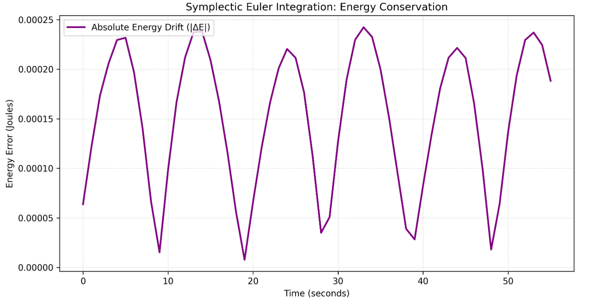

# Orbital 3-Body Simulation

An $N$-body gravitational simulator specifically tuned to demonstrate the **Montgomery-Chen Figure-8** stable orbital solution.

Simulating the 3-Body problem is notoriously difficult because the system is highly chaotic. Standard integration methods (like RK4 or Forward Euler) inject microscopic artificial energy into the system due to floating-point truncation, causing the Figure-8 orbit to eventually rip itself apart. This application serves as a testbed for verifying the numerical stability of the core physics engine.

## Physics & Mathematics

* **The Gravity Loop:** The engine calculates pair-wise Newtonian gravity using an optimized Inverse-Cube Law substitution (`1/r^3 * rVec`) to bypass costly square root normalization steps during the $O(N^2)$ accumulation phase.
* **The Integrator:** The system relies on a 1st-Order **Symplectic (Semi-Implicit) Euler** method. By strictly updating velocity *before* position, the truncation errors mathematically cancel out over the course of an orbit, perfectly conserving the system's "Shadow Hamiltonian" phase space.

## Engineering Validation

To mathematically prove the stability of the engine, the system tracks two strict metrics: **Energy Drift** and **Closure Error**.

  

### 1. Energy Conservation (Drift)
As shown in the data above, the Absolute Energy Drift $| \Delta E |$ never escapes a bounded box. Instead of growing exponentially (which would indicate an unstable solver), the energy oscillates within a tolerance of `0.00025` Joules. The Symplectic Integrator successfully prevents the system from gaining or losing artificial energy.

### 2. Figure-8 Closure Error
We can quantify the accuracy of the chosen timestep (`dt = 0.001`) by measuring the Euclidean distance between a particle's starting position and its position after exactly one theoretical orbital period ($T \approx 6.32591$ seconds).

* **Result:** After completing the highly chaotic orbital slingshot, the particles return to their mathematical origins with a closure error of **`0.0018` units**. Assuming a 1-unit = 1-meter scale, the orbital path deviates by less than 2 millimeters per year.