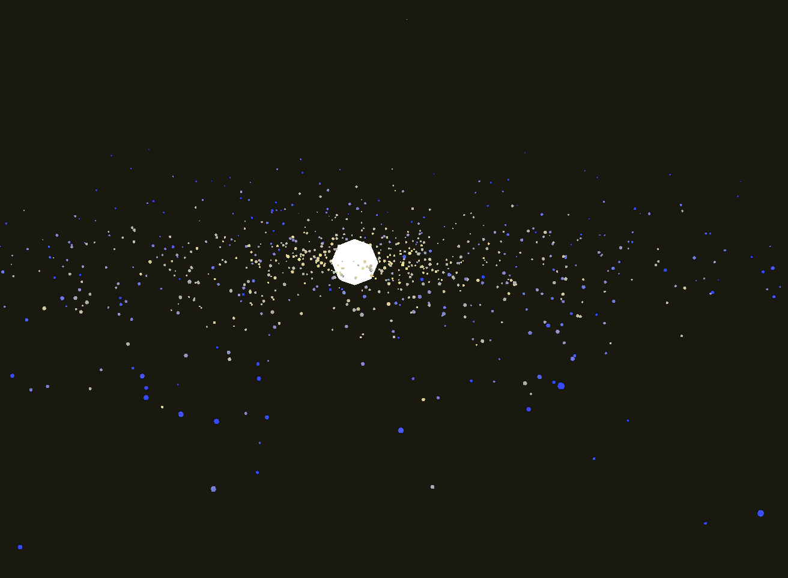

# 🌌 Computational Physics Engine: N-Body Galaxy Benchmark



## Overview
This repository contains a highly optimized, custom-built C++ and OpenGL computational physics engine. This specific benchmark application is an $\mathcal{O}(N^2)$ N-body gravity stress test, simulating the formation and orbital mechanics of a stable spiral galaxy using a **Plummer Sphere** density distribution. 

The goal of this project was to push a single consumer CPU to its absolute mathematical limits by shifting the compute bottleneck to the memory bandwidth wall using modern C++ performance paradigms.

## Engine Architecture & Optimizations

To simulate and render thousands of interacting bodies in real-time, the engine relies on strict memory management and parallelization:

* **Data-Oriented Design (Structure-of-Arrays):** Transitioned the physics accumulator from an Array-of-Structures (AoS) to a Structure-of-Arrays (SoA) layout. Decoupling the `glm::vec3 positions` from the heavy `glm::mat4` transformation matrices prevented CPU L1/L2 cache trashing during the $O(N^2)$ physics loop.
* **Hardware Parallelism (OpenMP):** The Newtonian gravity loop calculates $\frac{N(N-1)}{2}$ interactions per frame. By sacrificing Newton's 3rd Law memory writes to avoid thread racing, the $\mathcal{O}(N^2)$ accumulator was fully parallelized across all CPU cores using `#pragma omp parallel for schedule(static)`.
* **Algorithmic Fast Math:** Eliminated costly CPU division operations inside the inner gravity loop by utilizing approximated Inverse Square Roots (`1.0f / sqrt(x)`) and SIMD compiler instructions (`-ffast-math`).
* **Dynamic VBO Streaming:** Utilizes a custom, hardware-accelerated `glDrawElementsInstanced` graphics pipeline. Matrix and color data are streamed to GPU VRAM dynamically, eliminating CPU draw-call bottlenecks entirely.
* **Geometry LOD Scaling:** Uses programmable Level-of-Detail (LOD) generation for spherical geometry, dropping vertex counts drastically for macroscopic simulations.

## Mathematical Model

* **Integrator:** Symplectic Euler (proven to bound energy drift to $\pm 0.00025$ J during rigorous 3-body Figure-8 validations).
* **Initial Conditions:** Inverse Transform Sampling is used to map particles to a **Plummer Density Profile** ($r = a / \sqrt{u^{-2/3} - 1}$). The sphere is flattened into a disk, and stars are initialized with precise tangential velocities ($v = \sqrt{\frac{GM}{r}}$) relative to a supermassive core.
* **Softening Parameter:** An $\epsilon$ softening factor is added to the gravitational denominator to prevent $1/0$ singularities (infinite acceleration) during close-proximity particle collisions.

## 📊 Benchmark Metrics & Hardware Scaling
To validate the architectural efficiency of the engine, benchmarks were recorded across two distinct hardware and OS environments. 

**1. Virtualization Baseline:** An Intel i7 (Windows 11 / WSL2). Due to WSLg virtualization limitations, the GPU was bypassed, forcing the CPU to handle both the $O(N^2)$ math and `llvmpipe` software rendering.
**2. Bare-Metal Environment:** An older Intel i5 (Arch Linux). Running natively, the CPU handled exclusively physics while the integrated GPU (iGPU) handled the OpenGL instanced rendering.

| Particle Count | Environment | Avg. Physics Tick | Total Render Time/Sec | Real-Time FPS |
|----------------|-------------|-------------------|-----------------------|---------------|
| 2,000          | i7 (WSL2)   | ~3.1 ms           | ~816 ms               | ~85 FPS       |
| **2,000** | **i5 (Arch)**| **~4.0 ms*** | **~750 ms** | **~1,500 FPS**|
| 5,000          | i7 (WSL2)   | ~9.0 ms           | ~451 ms               | ~26 FPS       |
| **5,000** | **i5 (Arch)**| **Thermal Limit** | **N/A** | **~3 FPS** |

> **Thermodynamics & The Memory Wall:**
> *Running the engine natively on Arch Linux unlocked the OpenGL hardware pipeline, removing the rendering bottleneck and allowing the simulation to free-wheel at over 2,500 FPS "cold", and sustaining **~1,500 FPS** once thermal equilibrium was reached. However, at 5,000 particles (12.5 million gravity interactions per tick), the older i5 processor hit a hard thermal and L3 cache wall. The 100% OpenMP core utilization triggered aggressive thermal throttling, effectively proving that the software architecture has successfully shifted the simulation bottleneck from CPU draw-calls to raw hardware thermodynamic and memory-bandwidth limits.*

## Build Instructions (Linux)

**Dependencies:** CMake, GCC (C++17), OpenGL, GLFW, GLAD, GLM, OpenMP.

```bash
# Clone the repository
git clone [https://github.com/yourusername/instance-sim-engine.git](https://github.com/yourusername/instance-sim-engine.git)
cd instance-sim-engine

# Create the build directory
mkdir build && cd build

# Configure CMake with aggressive hardware optimizations
cmake -DCMAKE_BUILD_TYPE=Release ..

# Compile across all CPU cores
make -j$(nproc)

# Run the benchmark
./BenchmarkSim
